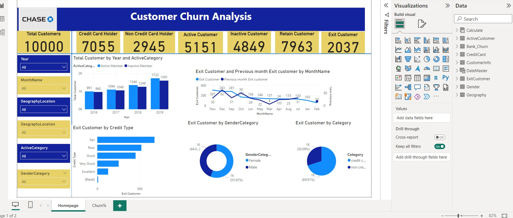

Power BI Analysis Report: Bank Customer Insights

Our recent Power BI project unveiled several crucial insights regarding bank customer behavior. The project involved comprehensive data management steps such as data cleaning, modeling, analysis, and visualization.

Data Management:
Upon importing data from an external source, we employed Power Query to transform and clean the data, ensuring its meaningfulness and relevance. Our modeling phase involved creating relationships between the primary table, 'Bank Chunk', and several associated tables including Gender, Geography, Exit Customer, Customer Info, Credit Card, and Active Customer. These relationships were primarily of a 'many-to-one' nature. We further enhanced the model by integrating a Date Master table using DAX formulas.

1. Customer Retention and Growth:
Our analysis from 2016 to 2019 reveals an upward trajectory in the number of active bank customers. Starting at 991 active customers in 2016, the bank witnessed a growth rate that culminated in 1,722 active customers by 2019. This growth trajectory not only illustrates the bank's robust retention strategies but also its ability to attract new customers. The increasing numbers suggest that the bank's services, offers, and customer relationship management have been resonating well with the clientele. The bank should continue to identify the factors driving this growth to further capitalize on them.

2. Influence of Credit Scores:
A deeper dive into credit scores reveals distinct behavior patterns. Customers with excellent credit scores showcase loyalty, suggesting that they find the bank's offerings tailored to their financial well-being. On the contrary, those with fair scores have a higher propensity to leave. This indicates potential dissatisfaction or the allure of better offers from competitors. The bank may need to revisit its strategies for this demographic, offering more competitive rates or personalized services.

3. Gender Disparity:
The data indicates a concerning trend: female customers are more likely to leave the bank than male customers. This could be due to a myriad of reasons - from not finding the bank's services tailored to their needs to potential biases in service delivery. It's crucial for the bank to conduct further research, perhaps through feedback surveys, to understand the underlying reasons and address them proactively.

4. Role of Credit Cards:
Non-credit card holders exhibit a higher tendency to exit the bank. This trend points towards the importance of credit card offerings in customer retention. The bank might be facing stiff competition from other institutions with more attractive credit card offers or benefits. Enhancing credit card offerings, introducing loyalty programs, or providing exclusive benefits can be potential strategies to retain these customers.

